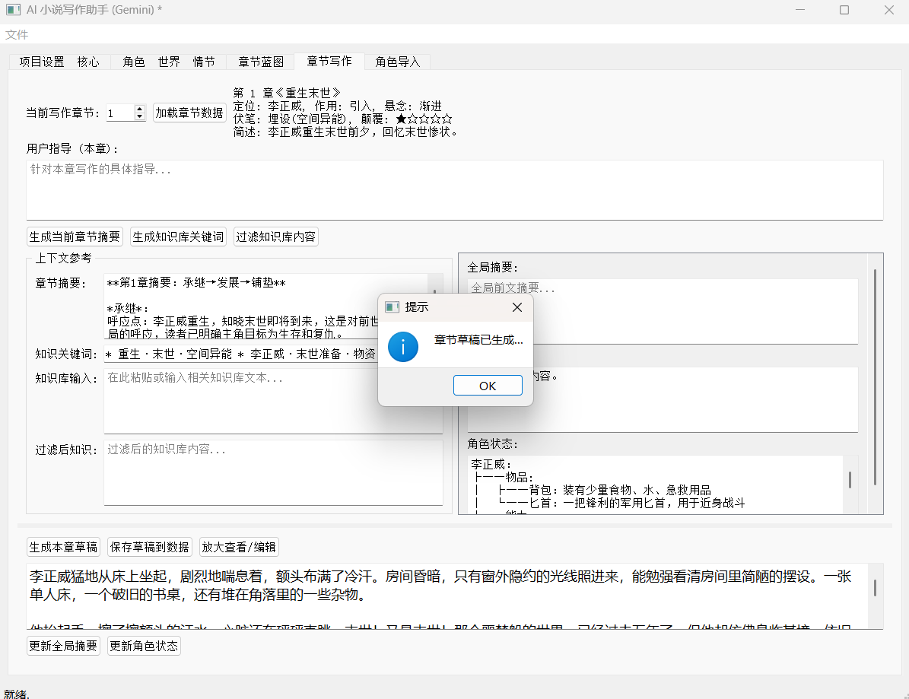

# AI_Novel_Writing

This is a desktop application built with Python and PyQt5, designed to assist users in brainstorming, planning, and drafting novels by leveraging the power of the Google Gemini API, combined with writing methodologies like the Snowflake Method, Character Arc theory, and suspense elements.

---

## ✨ Key Features

*   **Project Setup:** Define novel theme, genre, target chapter count, and words per chapter.
*   **Core Idea Generation (Snowflake Method):** Generate a single-sentence story essence.
*   **World & Character Building:** Generate character dynamics, world-building matrix, plot architecture, and initial character states.
*   **Chapter Planning / Blueprinting:** Generate full or chunked chapter blueprints, with an option to regenerate subsequent blueprints based on previously *written* content summary.
*   **Chapter Writing Assistance:** Load chapter data, generate chapter summaries, keywords, filter knowledge base, generate chapter drafts, and use an enlarged view for editing.
*   **Context & State Management:** Save drafts (in memory & as `.txt`), update global summary and character states based on saved chapters.
*   **Character Import:** Extract character info from pasted text.
*   **Project Management:** Save/Load entire project to/from JSON.
*   **Unsaved Changes Prompt:** Checks for unsaved changes before closing.
*   **Background Processing & Logging:** Uses threading for AI calls and logs activity.

---

## 📸 Screenshots (Example)


...

---

## 🛠️ Tech Stack

*   **Language:** Python 3
*   **GUI Framework:** PyQt5
*   **AI Model:** Google Gemini API (Pro models supported)
*   **Configuration:** python-dotenv (for API key)
*   **Data Storage:** JSON

---

## 📋 Prerequisites

*   Python 3.12
*   pip (Python Package Installer)
*   A valid Google Gemini API Key (obtainable from Google AI Studio)
*   Internet connection to access Google APIs

---

## ⚙️ Installation & Setup

1.  **Clone the repository:**
    ```bash
    git clone https://github.com/XiChen211/AI_Novel_Writing.git
    cd AI_Novel_Writing
    ```

2.  **Create a virtual environment (Recommended):**
     ```bash
    conda create -n novel python=3.12
    conda activate novel
    ```

3.  **Install dependencies:**
    ```bash
    pip install -r requirements.txt
    ```

4.  **Configure API Key:**
    *   Create a file named `.env` in the project root directory (same level as `main.py`).
    *   Add your Gemini API Key to this file:
        ```dotenv
        GEMINI_API_KEY=YOUR_API_KEY_HERE
        ```
        *(Replace `YOUR_API_KEY_HERE` with your actual key)*
    *   **Important:** Add `.env` to your `.gitignore` file. **DO NOT** commit your API key!

5.  **Select Gemini Model (Optional):**
    *   Default: `gemini-2.0-flash`.
    *   To use a different model (e.g., `gemini-1.5-pro-latest`), edit `GEMINI_MODEL_NAME` in `config.py`. Ensure your API key has access.

---
## 📂 File Structure (Key Files)


    AI_Novel_Writing/
    ├── .env                  # Stores API Key (DO NOT COMMIT)
    ├── chapters/             # Auto-saved chapter .txt files
    ├── config.py             # API key loading & model config
    ├── gemini_client.py      # Gemini API interaction class
    ├── main.py               # Application entry point
    ├── main_window.py        # Main window UI and logic
    ├── novel_data.py         # Class for storing & managing novel data
    ├── prompt.py             # All prompt definitions
    ├── prompt_loader.py      # Module for loading prompts
    ├── requirements.txt      # Project dependencies
    └── novel_assistant.log   # Log file
---

## 🚀 How to Run

In your activated virtual environment, navigate to the project root directory and run:

```bash
python main.py
 ```


---
# 📖 Step-by-Step Guide: Writing Your Novel from Scratch

---

This guide walks you through using the application to generate and write your novel, from initial setup to chapter drafting.

### Phase 0: 🛠️ Preparation

1.  Ensure you have completed the **Installation & Setup** steps mentioned earlier in the README.
2.  Launch the application (e.g., by running `python main.py` in your terminal).

---

### Phase 1: 🌱 Setting the Foundation (Tab 1: `Project Setup & Core`)

1.  **Define Basics:**
    *   Navigate to the **`Project Setup & Core`** tab.
    *   Fill in the **`Novel Theme`** field (e.g., "A detective investigating memory implants in a cyberpunk city").
    *   Fill in the **`Novel Genre`** field (e.g., "Sci-Fi Mystery").
    *   Adjust **`Target Chapters`** and **`Words per Chapter`** if you have specific goals different from the defaults.

2.  **Generate Core Seed:**
    *   Click the **`1. Generate Core Seed...`** button.
    *   Wait for the AI to process. The result (a concise, single-sentence summary) will appear in the **`Core Seed`** text box below.
    *   **Review:** Does the Core Seed accurately capture the essence of your intended story? If not, refine your `Novel Theme` and `Novel Genre` and click the button again.
    

---

### Phase 2: 🌍 Building the World and Characters (Tab 2: `Character & World & Plot`)

*(Requires a generated Core Seed from Phase 1)*

1.  **Provide Guidance (Optional but Recommended):**
    *   In the **`User Guidance (Optional)`** text box on the left side of this tab, add any specific constraints or desires for your characters, world, or plot. 

2.  **Generate Characters:**
    *   Click the **`2. Generate Character Dynamics`** button.
    *   The results will appear in the **`Character Dynamics`** tab on the right.
    *   **Review:** Examine the generated characters, their descriptions, motivations, arcs, and relationships. If they don't align with your vision, refine the `User Guidance` and regenerate.
    

3.  **Generate World:**
    *   Click the **`3. Generate World Building Matrix`** button.
    *   The results will appear in the **`World Building`** tab on the right.
    *   **Review:** Explore the physical, social, and metaphorical dimensions of the generated world. Does it fit the genre and theme? Regenerate with refined guidance if needed.
    

4.  **Generate Plot:**
    *   Click the **`4. Generate Plot Architecture`** button.
    *   The results will appear in the **`Plot Architecture`** tab on the right.
    *   **Review:** Analyze the proposed three-act structure, key events, inciting incident, climax, and turning points. Does the overall plot structure make sense? Regenerate if necessary.
    

5.  **Initialize Character State:**
    *   Click the **`Initialize Character State`** button.
    *   This action creates the initial `Character State` document based on the generated character dynamics. You can view this document in the **`Character State`** tab.
    

---

### Phase 3: 🗺️ Planning the Chapters (Tab 3: `Chapter Blueprint`)

*(Requires a generated Plot Architecture from Phase 2)*

1.  **Provide Guidance (Optional):**
    *   If you have specific ideas about chapter pacing, focus, or key scenes that aren't fully captured in the plot architecture, add them to the **`User Guidance`** field at the top of this tab before generating the blueprint.

2.  **Generate Blueprint:** Choose **one** of the following methods:
    *   **Full Generation:** Click **`Generate Chapter Blueprint (Full - Overwrite!)`** to create summaries/outlines for *all* chapters defined by the `Target Chapters` setting based on the `Plot Architecture`. This will overwrite any existing blueprint data.
    *   **Chunked Generation:** Select a starting and ending chapter number in the range selectors and click **`Generate/Overwrite Specified Range Blueprint`**. This generates blueprints only for the selected range. *(Note: This method typically relies only on the Plot Architecture and doesn't use summaries of previously written content).*
    *   **Regenerate Subsequent (Recommended for Continuation):** If you have already written some chapters (e.g., Chapters 1-5), select the *next* chapter number (e.g., 6) in the range selector. Then click **`Regenerate Subsequent Blueprints...`**. This powerful option first analyzes and summarizes your *already written* chapters (1-5) and then generates blueprints for the remaining chapters (6 onwards) based on both the original plot architecture *and* the summarized events of the written content, ensuring better continuity.

3.  **Review Blueprint:**
    *   Examine the generated list of chapter summaries/outlines in the **`Chapter Directory`** box.
    *   **Review:** Check the flow, pacing, and logical progression of events from chapter to chapter. Ensure key plot points from the `Plot Architecture` are included appropriately.
    

---

### Phase 4: ✍️ Writing Chapters (Tab 4: `Chapter Writing` - The Main Loop)

*(Repeat these steps for each chapter you intend to write)*

1.  **Select & Load Chapter:**
    *   Choose the chapter number you want to work on using the chapter selector (e.g., a dropdown or number input).
    *   Click the **`Load Chapter Data`** button.
    *   This will load the corresponding chapter blueprint, any previously saved draft for this chapter, and update the context panes (like **`Global Summary`**, **`Previous Excerpt`**, **`Character State`**) with relevant information.
    

2.  **Review Context:**
    *   Carefully read the loaded chapter blueprint/summary.
    *   Review the **`Global Summary`**, the excerpt from the **`Previous Chapter`**, and the current **`Character State`** to refresh your memory and ensure consistency.

3.  **Generate Chapter Context (Optional but Recommended):**
    *   Click **`Generate Current Chapter Summary`**. This often requires the *next* chapter's blueprint to exist to understand the chapter's immediate goal. The result appears in the **`Chapter Summary`** field, providing a focused context for the AI.
    *   Click **`Generate Knowledge Base Keywords`** to identify key terms for research relevant to this chapter.
    *   Paste any relevant research notes, world details, or specific information into the **`Knowledge Base Input`** box.
    *   Click **`Filter Knowledge Base Content`**. The system filters your input based on the generated keywords, presenting the most relevant snippets in the **`Filtered Knowledge`** pane for the AI to use.
    

4.  **Add Chapter-Specific Guidance:**
    *   Enter any specific instructions, desired dialogue snippets, scene requirements, or stylistic notes for *this particular chapter* into the **`User Guidance (This Chapter)`** text box.

5.  **Generate Draft:**
    *   Click the **`Generate Chapter Draft`** button.
    *   The AI will now attempt to write a draft of the chapter, utilizing all the context provided: the blueprint, global summary, previous excerpt, character state, filtered knowledge, and your specific guidance.
    *   The generated draft will appear in the main text editor area below the controls.
    

6.  **Review & Edit (❗ Crucial Step!):**
    *   **Critically read** the AI-generated draft. It's a starting point, not a final product.
    *   **Edit directly** in the text editor. Focus on:
        *   Fixing logical inconsistencies or plot holes.
        *   Improving sentence structure, flow, and word choice (prose polishing).
        *   Adding descriptive details, sensory information, and emotional depth.
        *   Removing redundant sentences or awkward phrasing.
        *   Ensuring character voices and actions are consistent.
        *   Checking for continuity errors.
    *   Use the **`Enlarge/Edit View`** button for a larger, more comfortable editing window. Remember to **`Save & Close`** the dialog to apply changes back to the main editor.


7.  **Save Draft:**
    *   Once you are reasonably satisfied with the draft (it doesn't need to be perfect yet, just substantially improved), click the **`Save Draft to Data`** button.
    *   This action saves the current text in the editor to the application's project data structure and typically also exports a plain text (`.txt`) version of the chapter to a designated `chapters/` folder in your project directory for easy access.
      
    

8.  **Update Context (After Saving Draft):**
    *   Click the **`Update Global Summary`** button. This incorporates the events of the chapter you just saved into the overall story summary, keeping the context current for future chapter generation.
    *   Click the **`Update Character State`** button. This analyzes the saved chapter for significant changes in character relationships, status, knowledge, or location and updates the character state document accordingly.
      

9.  **Proceed to Next Chapter:**
    *   Increment the chapter number selector to the next chapter you want to write.
    *   Click **`Load Chapter Data`** (Step 1) to begin the process again for the new chapter.

---

### Phase 5: 💾 Maintenance & Saving

*   **Save Project:** Regularly use the **`File`** -> **`Save Project`** menu option. This saves the *entire state* of your project (settings, core seed, characters, world, plot, blueprints, drafts, summaries, character state) to a single project file (often a `.json` file). **Do this frequently to avoid losing work!**
    
*   **Load Project:** Use **`File`** -> **`Load Project`** to open a previously saved project file and resume your work exactly where you left off.
    
*   **Iterate & Revise:** Writing is rewriting! After completing a first draft using the steps above, you can go back through the chapters. Load each chapter individually (Phase 4, Step 1), edit it further (Phase 4, Step 6), save the revised draft (Phase 4, Step 7), and update the context (Phase 4, Step 8) to reflect major revisions before moving to the next chapter for editing.

---
